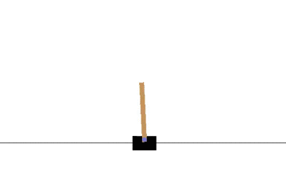
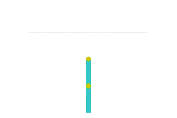

# ClassicControlDQN
Use single DQN model to solve 2 classic control problem: CartPole and Acrobot

## Problems description
### CartPole
<br>
A pole is attached by an un-actuated joint to a cart, which moves along a frictionless track. The system is controlled by applying a force of +1 or -1 to the cart. The pendulum starts upright, and the goal is to prevent it from falling over. A reward of +1 is provided for every timestep that the pole remains upright. The episode ends when the pole is more than 15 degrees from vertical, or the cart moves more than 2.4 units from the center.
### Acrobot
<br>
The acrobot system includes two joints and two links, where the joint between the two links is actuated. Initially, the links are hanging downwards, and the goal is to swing the end of the lower link up to a given height.

## Installation Dependencies:
* Python 2.7
* Numpy
* TensorFlow 0.8
* gym

## How to Run?
```
git clone https://github.com/lbbc1117/ClassicControlDQN.git
cd ClassicControlDQN
python cart_pole.py
python acrobot.py
```

## Network Architecture
The model used here is a simple plain neural network which contains 3 fully connected hidden layers. Each hidden layer has 128 units, and use ReLU as non-linear activation function.
You can change the hidden size freely by passing arguments to overwrite the defaults. But you may have to change the codes to add or delete layers.

## Resources
1. [TensorFlow] (http://www.tensorflow.org/)
2. [gym] (https://gym.openai.com/)<br>
OpenAI Gym is a toolkit for developing and comparing reinforcement learning algorithms. It provides excellent environments of control problems.

